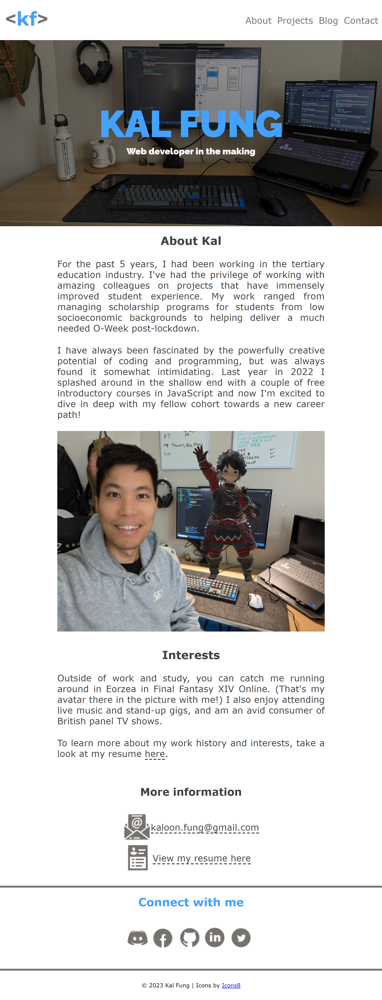
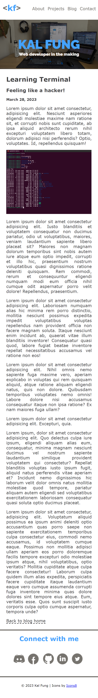
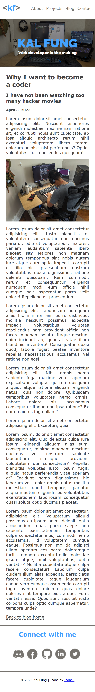
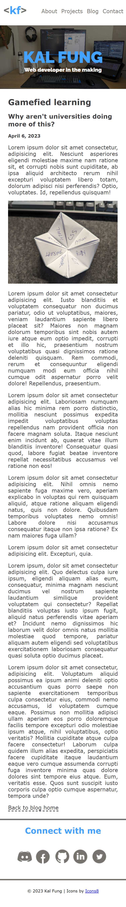
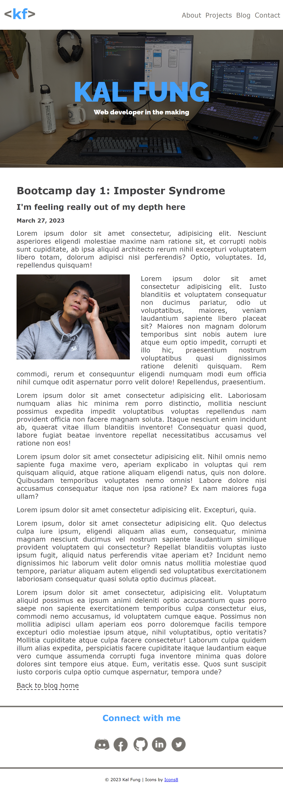
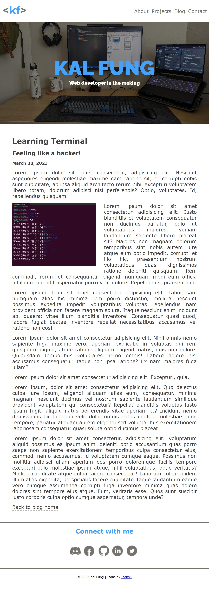
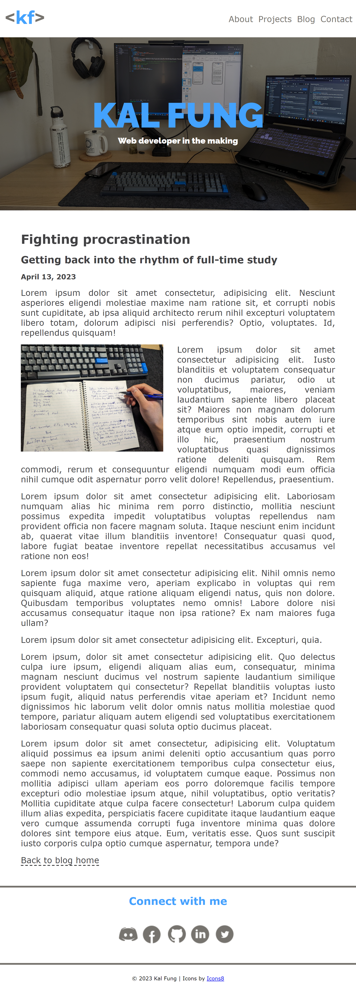
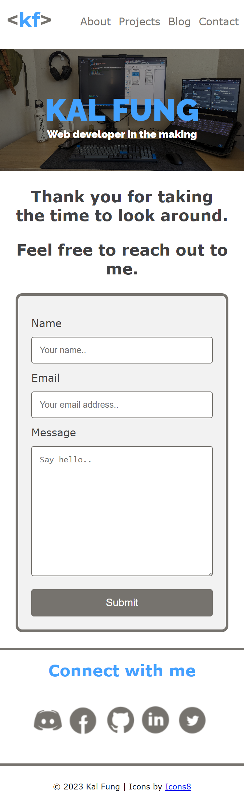
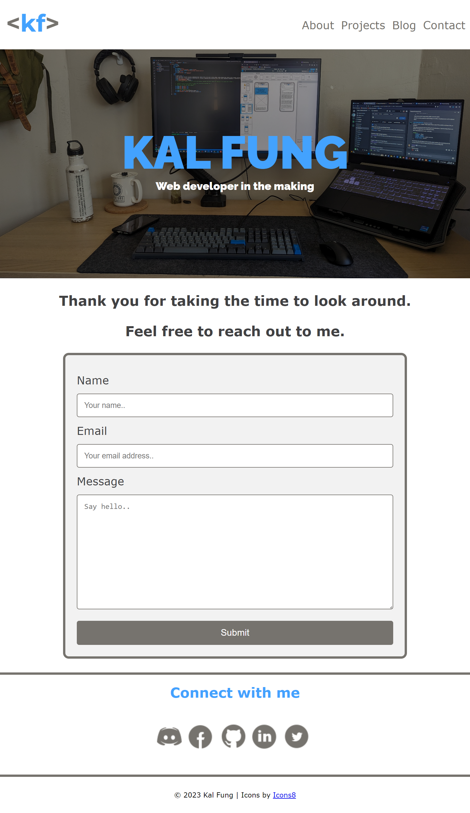

# **Coder Academy - Assignment T1A2 - Portfolio Website by Kaloon Fung**

## **Table of contents**

- [**Coder Academy - Assignment T1A2 - Portfolio Website by Kaloon Fung**](#coder-academy---assignment-t1a2---portfolio-website-by-kaloon-fung)
    - [**Table of contents**](#table-of-contents)
    - [**Links**](#links)
    - [**Purpose**](#purpose)
    - [**Target audience**](#target-audience)
    - [**Functionality and features**](#functionality-and-features)
    - [**Sitemap**](#sitemap)
    - [**Wireframes**](#wireframes)
        - [Landing / Home page wireframes](#landing--home-page-wireframes)
        - [About wireframes](#about-wireframes)
        - [Projects wireframes](#projects-wireframes)
        - [Blog wireframes](#blog-wireframes)
        - [Blog entries wireframes](#blog-entries-wireframes)
        - [Contact wireframes](#contact-wireframes)
    - [**Screenshots**](#screenshots)
        - [Landing / Home page screenshots](#landing--home-page-screenshots)
        - [About screenshots](#about-screenshots)
        - [Projects screenshots](#projects-screenshots)
        - [Blog screenshots](#blog-screenshots)
        - [Blog entries screenshots](#blog-entries-screenshots)
        - [Contact screenshots](#contact-screenshots)
    - [**Tech stack**](#tech-stack)
    - [**Author**](#author)

## **Links**

- [Portfolio Website](https://kaloonfung-t1a2.vercel.app/)
- [GitHub Repository](https://github.com/kalfung/KaloonFung_T1A2)
- [Slide deck presentation video - YouTube](MUST INSERT LINK HERE ONCE THE VIDEO UPLOAD IS COMPLETE)

## **Purpose**

The purpose of this website is to:
- present in an online portfolio a showcase of my projects, skills, and professional knowledge
- provide information about my work and education history, and interests
- make a great first impression for prospective employers and clients
- express my personality and capabilities through its clean and minimalist design 

## **Target audience**

The target audience for this portfolio website are potential employers seeking to engage a junior web developer and IT professional. This website will demonstrate to them my technical knowledge of information technology, software development/codin, programming languages and development stacks. 

The audience for this website also includes my fellow students that would like to collaborate with someone with a great work ethic and professional attitude.

## **Functionality and features**

## **Sitemap**

Sitemap and wireframes were created and exported using Balsamiq Cloud

## **Wireframes**

### **Landing / Home page wireframes**

### **About wireframes**

### **Projects wireframes**

### **Blog wireframes**

### **Blog entries wireframes**

### **Contact wireframes**

## **Screenshots**

### **Landing / Home page screenshots**

### **About screenshots**

### **Projects screenshots**

### **Blog screenshots**

### **Blog entries screenshots**

### **Contact screenshots**

## **Tech stack**

- Website: Semantic HTML5 markup and CSS
- Sitemap: [Balsamiq Cloud](https://balsamiq.cloud/)
- Wireframes: [Balsamiq Cloud](https://balsamiq.cloud/)
- Image editing: Paint
- Deployment: [Vercel](https://vercel.com/)
- Slide deck: [Google Slides](https://docs.google.com/presentation/)

## **Author**

- Twitter - [@Cow_Fungus](https://twitter.com/cow_fungus)
- GitHub - [@kalfung](https://github.com/kalfung)
- LinkedIn [@KaloonFung](https://au.linkedin.com/in/kaloon-fung-a809a3152)

[Go to top of page](./README.md#coder-academy---assignment-t1a2---portfolio-website-by-kaloon-fung)