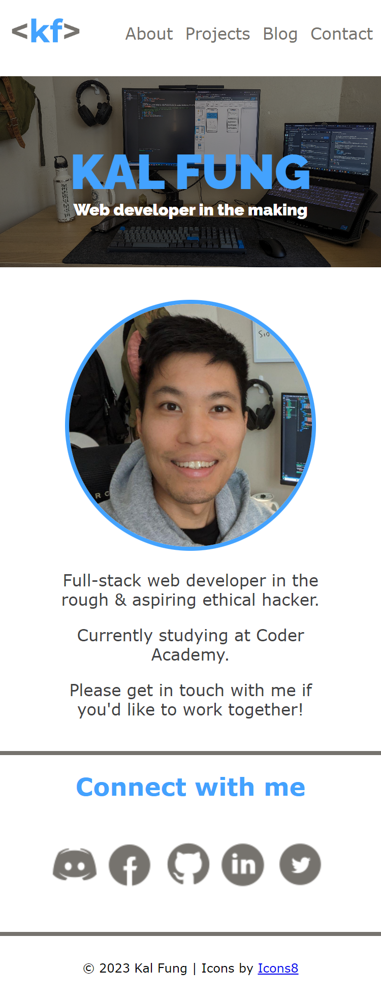
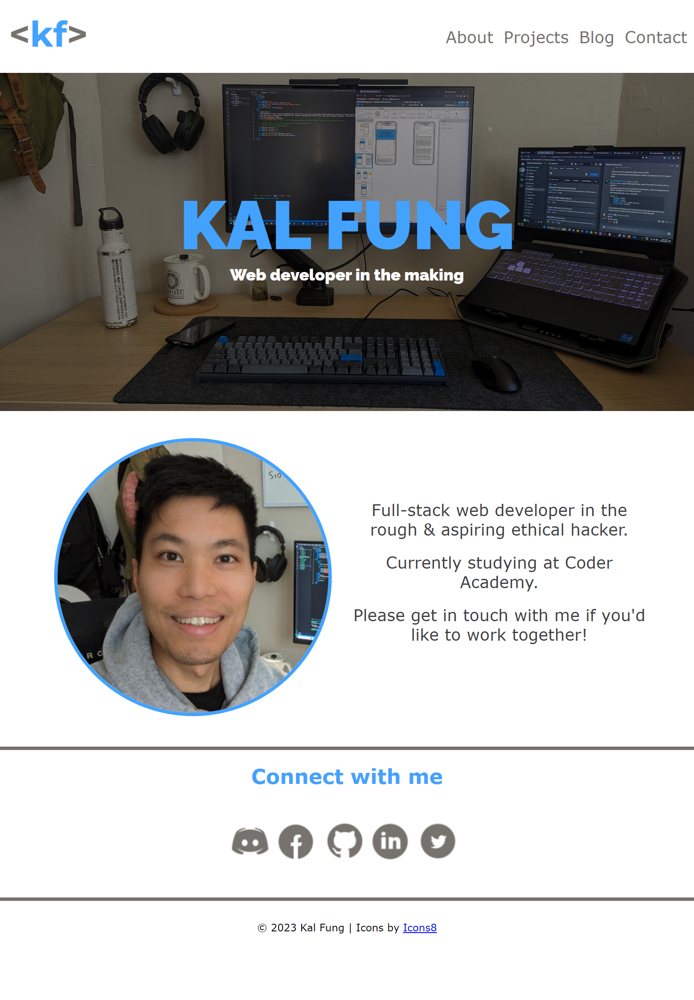
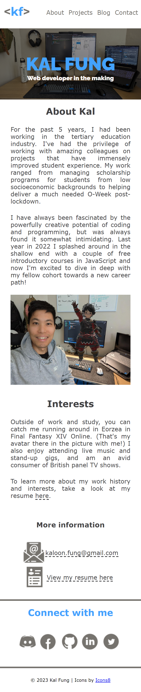
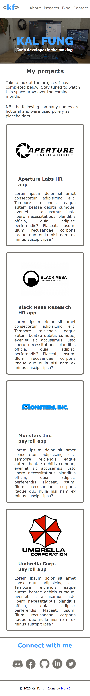
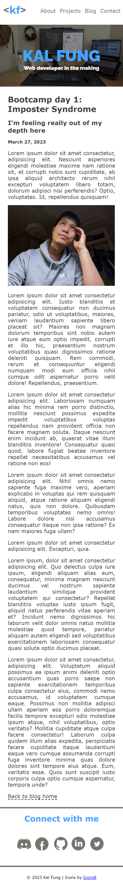
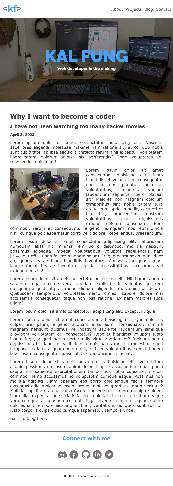
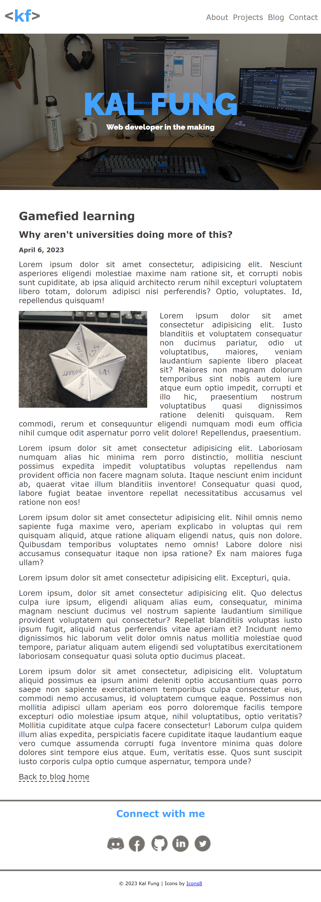

# **Coder Academy - Assignment T1A2 - Portfolio Website by Kaloon Fung**

## **Table of contents**

- [**Coder Academy - Assignment T1A2 - Portfolio Website by Kaloon Fung**](#coder-academy---assignment-t1a2---portfolio-website-by-kaloon-fung)
    - [**Table of contents**](#table-of-contents)
    - [**Links**](#links)
    - [**Purpose**](#purpose)
    - [**Target audience**](#target-audience)
    - [**Functionality and features**]

## **Links**

- [Portfolio Website](https://kaloonfung-t1a2.vercel.app/)
- [GitHub Repository](https://github.com/kalfung/KaloonFung_T1A2)
- [Slide deck presentation video - YouTube](MUST INSERT LINK HERE ONCE THE VIDEO UPLOAD IS COMPLETE)

## **Purpose**

## **Target audience**

## **Functionality and featuers**

## **Sitemap**

Sitemap and wireframes were created and exported using Balsamiq Cloud

## **Wireframes**

### **Landing / Home page wireframes**

### **About wireframes**

### **Projects wireframes**

### **Blog wireframes**

### **Blog entries wireframes**

### **Contact wireframes**

## **Screenshots**

### **Landing / Home page screenshots**

### **About screenshots**

### **Projects screenshots**

### **Blog screenshots**

### **Blog entries screenshots**

### **Contact screenshots**

